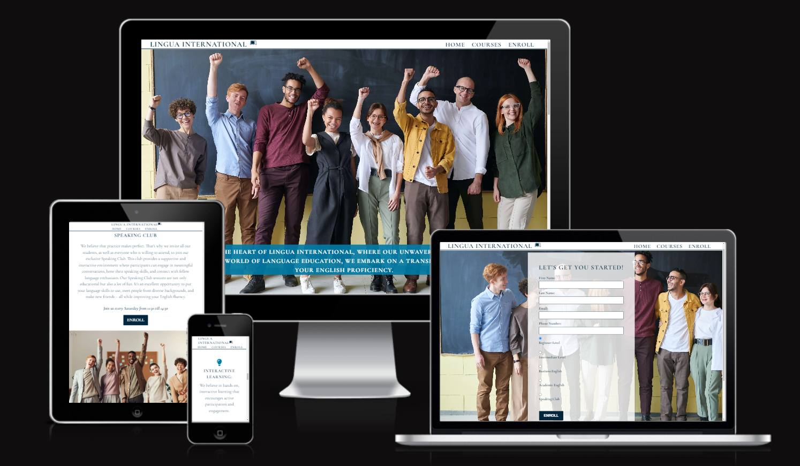

Lingua International

Lingua International is a dynamic platform designed to empower individuals from diverse backgrounds with the invaluable skill of English proficiency. 

The school caters to a broad spectrum of learners, including beginners eager to embark on their English learning journey and those seeking to refine their existing skills. Language acquisition is not just about mastering grammar and vocabulary but also about engaging in meaningful conversations. That's why we host an open speaking club accessible to all, encouraging students to discuss everyday life and a wide range of topics, bridging cultures and perspectives. We welcome not only English learners but also native speakers who wish to connect, share their experiences, and contribute to a vibrant language exchange environment. 

The plstform ensures that whether you're a non-native speaker striving for fluency or a native speaker eager to share your language and culture, Lingua International has something enriching for everyone.

- Business Goals:

Primary Goal: To establish Lingua International as a leading platform for English language learning and language exchange.
Secondary Goal: To create a vibrant and inclusive community of English learners and native speakers.

- User Needs:

Language Learners: Provide a platform for individuals of all levels (beginner to advanced) to improve their English language skills.

Language Enthusiasts: Offer a space for native English speakers to connect, share experiences, and engage in language exchange.

Cultural Exchange: Foster cultural exchange and understanding among users from diverse backgrounds.

Meaningful Conversations: Facilitate engaging conversations on various topics to enhance language acquisition.

Accessibility: Ensure accessibility for all users.

