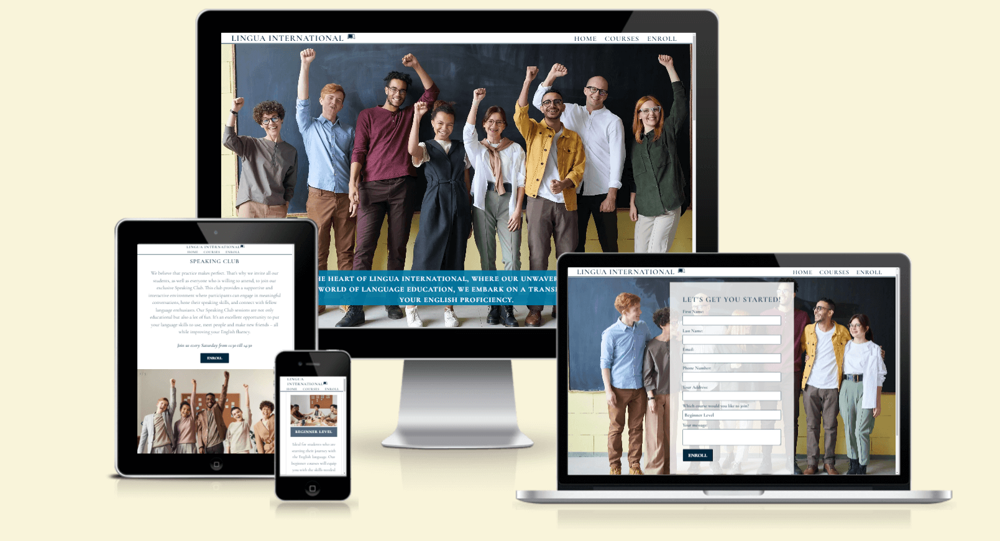
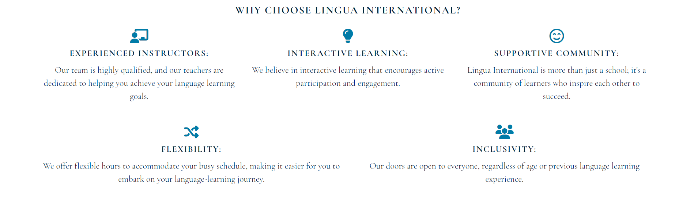
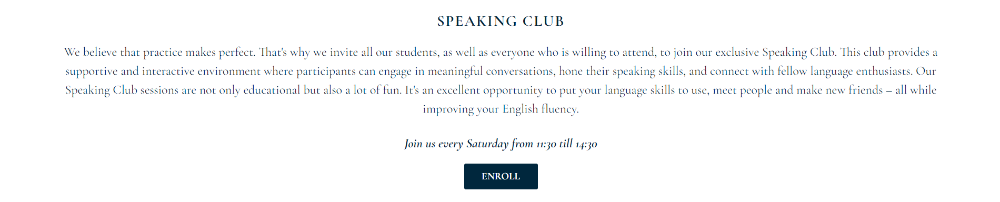
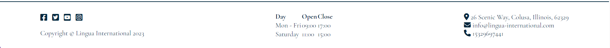

___
# Lingua International

Lingua International is a dynamic platform designed to empower individuals from diverse backgrounds with the invaluable skill of English proficiency. 

The school caters to a broad spectrum of learners, including beginners eager to embark on their English learning journey and those seeking to refine their existing skills. Language acquisition is not just about mastering grammar and vocabulary but also about engaging in meaningful conversations. That's why the school host an open speaking club accessible to all, encouraging students to discuss various topics, bridging cultures and perspectives. The club welcomes not only English learners but also native speakers who wish to connect, share their experiences, and contribute to a vibrant language exchange environment. 

The platform ensures that whether you're a non-native speaker striving for fluency or a native speaker eager to share your language and culture, Lingua International has something enriching for everyone.

>Business Goals:

1. To establish Lingua International as a leading platform for English language learning and language exchange.

2. To create a vibrant and inclusive community of English learners and native speakers.

>User Needs:

1. Language Learners: Provide a platform for individuals of all levels (beginner to advanced) to improve their English language skills.

2. Language Enthusiasts: Offer a space for native English speakers to connect, share experiences, and engage in language exchange.
___

## Features

The Lingua International website offers several key features for its users.

__Existing Features__
___
- __Navigation Bar:__

Navigation Bar is featured on all pages of the website. It is fixed so the user should not scroll up to switch between the pages. It includes the Logo with the attached link to the homepage, Home page, Courses page and Enroll page.

This section will allow to easily explore and access various sections of the website. It provides value by offering quick and convenient navigation, enabling users to find the information they are looking for efficiently. 

___
- __Home Page:__

The home page provides a welcoming introduction to Lingua International, emphasizing dedication to English language education and their transformative approach to elevate English proficiency.
It is for potential students and individuals interested in learning English.

___
- __About Us:__

The "About Us" section introduces Lingua International's mission and commitment to providing top-quality English language education, creating a sense of trust. It contains a call to action paragraph and a button to go to the course offerings.
It's for potential students who want to learn more about the school and its values.

___
- __Why Choose Lingua International?:__

This section highlights the key benefits of choosing Lingua International, such as experienced instructors, interactive learning, a supportive community, flexibility in scheduling, and inclusivity.
It's for potential students who are evaluating their options and want to understand why Lingua International stands out.

___
- __Speaking Club:__

The Speaking Club provides a platform to practice English speaking skills in a supportive and interactive environment, fostering fluency and community building.
It's for both current students and anyone interested in improving their English speaking skills and connecting with others. It is also open for native speakers. Below the section there is an enroll button to sign up.

___
- __Photo caurousel:__

Photo carousel consists of three photos from the course to demonstate the friendly and positive atmosphere students are learning in. 
This feature aims to appeal to prospective students, helping them envision the welcoming environment students will be a part of and encouraging them to choose the school for its nurturing educational atmosphere.

___
- __Courses:__

This section contains  details about the various English language courses offered by Lingua International, helping users understand the available options and how they can achieve their language learning goals. The School offers English language courses for individuals at different proficiency levels. The courses offered are two basic courses (beginner level and intermediate level).

And two advanced courses (business English and academic English).

Each course has a content description that aligns with each user's goals and needs, duration, flexible scheduling options and costs. And enroll button to enroll on the desired course easily.
It's for prospective students seeking information about the courses offered.
___
- __Enroll:__

The enrollment section provides a pathway for interested individuals to take the next step in their language-learning journey by signing up for courses. The form consists of the following elements: First Name, Last Name, Email, Phone Number, address, select area for a course of interest, and Message.

This is for prospective students who are ready to enroll in a course.
___
- __Footer__

The footer section enhances the user experience and provides valuable information to visitors. It is featured on all pages of the website.

The footer section caters to language learners, prospective students, and individuals interested in services. It serves as a hub for contact information and social engagement.

The footer consists of the following elements:

Social Media Links (Facebook, Twitter, Instagram, YouTube): These links allow users to easily connect with the school on various platforms.This feature is especially useful for language enthusiasts, potential students, and anyone interested in staying connected with Lingua International.

Copyright © Lingua International 2023: The copyright notice in the footer protects intellectual property and also assures users that the content is up-to-date.

Business Hours: It helps users to plan their interactions with the school. It is beneficial for students and clients who want to visit physical location or contact the school during working hours.

Address: Physical address allows users to quickly locate the school. This information is essential for potential students and clients who may want to visit the premises for consultations, classes, or other inquiries.

Email Address and Phone Number: It offers users additional communication channels. This is valuable for inquiries, support, and general correspondence. Users can easily reach out to the school for any language-related questions or concerns.
___
- __Thank you page__

After registering, a user is redirected to thank you form to confirm their registration is successful and express gratitude.

## Features Left to Implement:
- Online lessons, masterclasses, webinars
- Blog
- Downloadable resources like speaking tips, presentations, and reading materials
- Access to recordings or transcripts of past club meetings and events
- Calendar of upcoming events and courses
- Chat for members to discuss speaking topics, share ideas, and seek advice
- A pop out window to subscribe to a newsletter for updates and event notifications
- Testimonials and Stories

## Testing
I conducted the following testing:

__Functionality Testing:__
- Verified that all links work correctly
- Tested the forms
- Ensured that the site's navigation menus and buttons work as expected

__Compatibility Testing:__
- Checked how the website works on different web browsers - Chrome, Firefox, Edge
- Tested the website on desktop and mobile
- Tested the website on Windows and Android

__Performance Testing:__
Performance testing was done with Lighthouse.
The current results are the following:

The bugs that were fixed are:

-resized images and converted them to webp

-added alt to images in carousel

-added  header "Day" to table element

-remove stray tags - body and header, main

-change colors for contrast on carousel and navigation menu

__The bugs left to fix:__
- Serve static assets with an efficient cache policy 
- make the links craable on the carousel for previous and next buttons

__Validator Testing__
HTML: No errors were returned when passing through the W3C validator
home page(https://validator.w3.org/nu/#textarea)
enroll page https://validator.w3.org/nu/#textarea

CSS: No errors were found when passing through the (Jigsaw) validator

